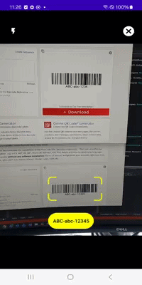
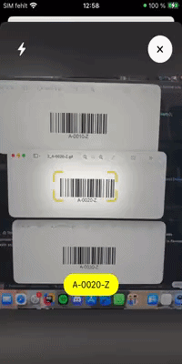
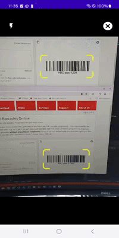
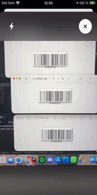

# 📱 Plugin.Scanner

# EARLY ALPHA

- Planned
  - More options for IBarcodeScanner(Zoom, multiple recognition, enable/disable highlighting, recognition area)
  - Custom data scanner view with overlay etc.
  - Custom overlay for IBarcodeScanner
  - Custom behavior for IBarcodeScanner
  - TextScanner and DocumentScanner

# 🚀 Mobile cross platform data scanner

[](https://www.nuget.org/packages/Plugin.Scanner)
[](LICENSE)
[](#platforms)
[](#platforms)

This plugin aims to enalbe *simple*, *fast* and *customizable* data scanning(barcodes, text, documents...) using native **Android** and **iOS** APIs [ML Kit](https://developers.google.com/ml-kit?hl=de) and [Vision Kit](https://developer.apple.com/documentation/visionkit?language=objc).
- Platform support **iOS 16+** and **Android 23+**
- One Shared API cross platforms and frameworks
- Scan barcodes with only 2 lines of code

## 🚀 Get started

### 🔧 Platform specific setup

To access the scanner functionality, the following platform-specific setup is required. **The application will crash without this setup.** 

<details>
<summary><b>iOS</b></summary>

In the Info.plist file, add the following keys and values:
```xml
<key>NSCameraUsageDescription</key>
<string>This app needs access to the camera to scan data.</string>
```

</details>

<details>
<summary><b>Android</b></summary>

The CAMERA permission is required and must be configured in the Android project. In addition:
```xml
<uses-permission android:name="android.permission.CAMERA" />
<uses-permission android:name="android.permission.FLASHLIGHT" />
```

</details>

### ⬇️ Installation

Install the NuGet package:

<details>
<summary><b>MAUI</b></summary>

```bash
dotnet add package Plugin.Scanner.Maui
```

</details>

<details>
<summary><b>Uno</b></summary>

```bash
dotnet add package Plugin.Scanner.Uno
```

</details>

<details>
<summary><b>Avalonia</b></summary>

```bash
dotnet add package Plugin.Scanner.Avalonia
```

</details>

Please note: If you encounter [this issue](https://github.com/dotnet/maui/issues/17828#issuecomment-1897879300), you will need to enable long path support as described [here](https://learn.microsoft.com/en-us/windows/win32/fileio/maximum-file-path-limitation?tabs=registry#registry-setting-to-enable-long-paths).

### ⚙️ Setup

<details>
<summary><b>MAUI</b></summary>

Enable the plugin in your `MauiProgram.cs`:

```csharp
namespace Plugin.Scanner.Maui.Hosting;

public static MauiApp CreateMauiApp()
{
    var builder = MauiApp.CreateBuilder();
    builder.UseScanner();
    return builder.Build();
}
```

</details>

<details>
<summary><b>Uno</b></summary>

Enable the plugin in your `App.xaml.cs`:

```csharp
using Plugin.Scanner.Uno.Hosting;

protected override async void OnLaunched(LaunchActivatedEventArgs args)
{
    IApplicationBuilder builder = this.CreateBuilder(args)
        .UseScanner();
    MainWindow = builder.Window;

    Host = await builder.NavigateAsync<Shell>();
}
```

</details>

<details>
<summary><b>Avalonia</b></summary>

Initialize the plugin in your android `MainActivity.cs`:

```csharp
protected override void OnCreate(Bundle? savedInstanceState)
{
    base.OnCreate(savedInstanceState);
     
    Hosting.Scanner.Init(this);
}
```

</details>

## 🔳 Barcode scanning

<details>
<summary><b>Implementation details</b></summary>

- On iOS the scanner uses VisionKits [DataScannerViewController](https://developer.apple.com/documentation/visionkit/datascannerviewcontroller?language=objc)
- On Android the scanner uses Googles [BarcodeScanner](https://developers.google.com/android/reference/com/google/mlkit/vision/barcode/BarcodeScanner)

</details>

<details>
<summary><b>MAUI & Uno</b></summary>

Resolve the registered IBarcodeScanner service and scan a single barcode in all supported formats

```csharp
using Plugin.Scanner.Core.Barcode;
using Plugin.Scanner.Core.Exceptions;

public class MainViewModel
{
    private readonly IBarcodeScanner _barcodeScanner;

    public MainViewModel(IBarcodeScanner barcodeScanner)
    {
        _barcodeScanner = barcodeScanner;
    }

    public async Task ScanBarcode()
    {
        try
        {
            IBarcode barcode = (await _barcodeScanner.ScanAsync(new BarcodeScanOptions() { Formats = BarcodeFormat.All }).ConfigureAwait(false)).RawValue;
        }
        catch(BarcodeScanException exception)
        {
            Debug.WriteLine(exception);
        }
    }
}
```

</details>

<details>
<summary><b>Avalonia</b></summary>

Since dependency injection is not available out of the box a static implementation of the scanner must be used.
If you use dependency injection register the IBarcodeScanner serivce with the `IServiceCollection.AddBarcodeScanner()` extension method. See Maui and Uno examples.

```csharp
using Plugin.Scanner.Core.Barcode;
using Plugin.Scanner.Core.Exceptions;

public partial class MainViewModel
{
    public async Task ScanBarcode()
    {
        try
        {
            IBarcode barcode = (await BarcodeScanner.Default.ScanAsync(new BarcodeScanOptions() { Formats = BarcodeFormat.All }).ConfigureAwait(false)).RawValue;
        }
        catch (BarcodeScanException exception)
        {
            Debug.WriteLine(exception);
        }
    }
}
```

</details>

### 🟢 Detect only specific format(s)?

<details>
<summary><b>Create options and set the target formats(s)</b></summary>

```csharp
var options = new BarcodeScanOptions
{
    Formats = BarcodeFormat.QR | BarcodeFormat.Ean13
};

using var cts = new CancellationTokenSource(TimeSpan.FromMinutes(1));
var barcode = await scanner.ScanAsync(options, cts.Token);
Console.WriteLine($"Scanned: {barcode.RawValue}");
```

</details>

### 🟢 There are multiple barcodes in the frame? 

<details>
<summary><b>Single recognition(default)</b></summary>

- `_barcodeScanner.ScanAsync(new BarcodeScanOptions())`
  - First detected barcode is highlighted
  - Tap on target barcode to highlight it, display confirmation button and complete the scan</br> </br>
    
  
  
  
</details>

<details>
<summary><b>Multiple recognition</b></summary>

- `_barcodeScanner.ScanAsync(new BarcodeScanOptions({ RecognizeMultiple = true }))`
  - All detected barcodes are highlighted
  - Tap on target barcode to display confirmation button and complete the scan</br> </br>

  
  
  
</details>

### 🟢 You don't want to highlight detected barcodes? 

<details>
<summary><b>Highlighting enabled(default)</b></summary>

- `_barcodeScanner.ScanAsync(new BarcodeScanOptions())`
  - All detected barcodes are highlighted</br> </br>

  <!-- ToDo ADD GIF -->


</details>

<details>
<summary><b>Highlighting disabled</b></summary>

- `_barcodeScanner.ScanAsync(new BarcodeScanOptions({ IsHighlightingEnabled = false }))`
  - No detected barcode is highlighted</br> </br>

  <!-- ToDo ADD GIF -->


</details>

### 🟢 Allow a two-finger pinch-to-zoom gesture? 

<details>
<summary><b>Pinch to zoom enabled(default)</b></summary>

- `_barcodeScanner.ScanAsync(new BarcodeScanOptions())`

  <!-- ToDo ADD GIF -->

</details>

<details>
<summary><b>Pinch to zoom disabled</b></summary>

- `_barcodeScanner.ScanAsync(new BarcodeScanOptions({ IsPinchToZoomEnabled = false }))`
  - No zoom allowed</br> </br>

  <!-- ToDo ADD GIF -->

</details>
