# 📱 Plugin.Scanner

# EARLY ALPHA

- Planned
  - Custom data scanner view with overlay etc.
  - DocumentScanner

# 🚀 Mobile cross platform data scanner

[](https://www.nuget.org/packages/Plugin.Scanner)
[](LICENSE)
[](#platforms)
[](#platforms)

This plugin aims to enable *simple*, *fast* and *customizable* data scanning(barcodes, text, documents...) using native **Android** and **iOS** APIs [ML Kit](https://developers.google.com/ml-kit?hl=de) and [Vision Kit](https://developer.apple.com/documentation/visionkit?language=objc).
- Platform support **iOS 16+** and **Android 23+**
- One shared API cross platforms and frameworks
- Scan barcodes, texts and documents with only two lines of code

# 🔳  Barcode scanning
|                                                              |                                                         |                                                                 |
|--------------------------------------------------------------|---------------------------------------------------------|-----------------------------------------------------------------|
| 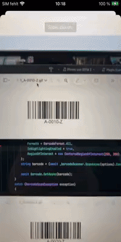 | 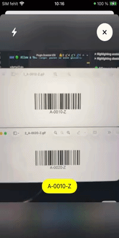 | 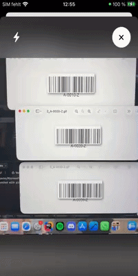 | </br> </br>
| 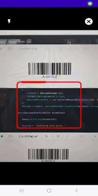        | 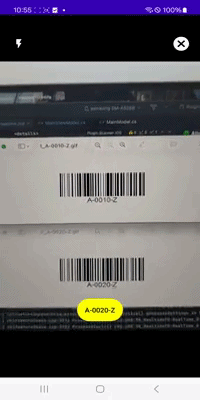        | 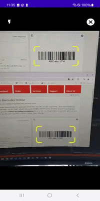        |

# 🔎 Text scanning
|                                                           |                                                      |                                                          |
|-----------------------------------------------------------|------------------------------------------------------|----------------------------------------------------------|
| 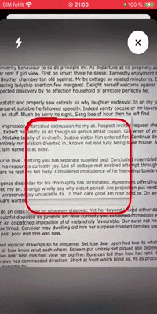 |  | 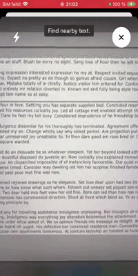    |
|      |      |  |

## 🚀 Get started

### 🔧 Platform specific setup

To access the scanner functionality, the following platform-specific setup is required. **The application will crash without this setup.** 

<details>
<summary><b>iOS</b></summary>

In the Info.plist file, add the following keys and values:
```xml
<key>NSCameraUsageDescription</key>
<string>This app needs access to the camera to scan data.</string>
```

</details>

<details>
<summary><b>Android</b></summary>

The CAMERA permission is required and must be configured in the Android project. In addition:
```xml
<uses-permission android:name="android.permission.CAMERA" />
<uses-permission android:name="android.permission.FLASHLIGHT" />
```

</details>

### ⬇️ Installation

Install the NuGet package:

<details>
<summary><b>MAUI</b></summary>

```bash
dotnet add package Plugin.Scanner.Maui
```

</details>

<details>
<summary><b>Uno</b></summary>

```bash
dotnet add package Plugin.Scanner.Uno
```

</details>

<details>
<summary><b>Avalonia</b></summary>

```bash
dotnet add package Plugin.Scanner.Avalonia
```

</details>

Please note: If you encounter [this issue](https://github.com/dotnet/maui/issues/17828#issuecomment-1897879300), you will need to enable long path support as described [here](https://learn.microsoft.com/en-us/windows/win32/fileio/maximum-file-path-limitation?tabs=registry#registry-setting-to-enable-long-paths).

### ⚙️ Setup

<details>
<summary><b>MAUI</b></summary>

Enable the plugin in your `MauiProgram.cs`:

```csharp
namespace Plugin.Scanner.Maui.Hosting;

public static MauiApp CreateMauiApp()
{
    var builder = MauiApp.CreateBuilder();
    builder.UseScanner();
    return builder.Build();
}
```

</details>

<details>
<summary><b>Uno</b></summary>

Enable the plugin in your `App.xaml.cs`:

```csharp
using Plugin.Scanner.Uno.Hosting;

protected override async void OnLaunched(LaunchActivatedEventArgs args)
{
    IApplicationBuilder builder = this.CreateBuilder(args)
        .UseScanner();
    MainWindow = builder.Window;

    Host = await builder.NavigateAsync<Shell>();
}
```

</details>

<details>
<summary><b>Avalonia</b></summary>

Initialize the plugin in your android `MainActivity.cs`:

```csharp
protected override void OnCreate(Bundle? savedInstanceState)
{
    base.OnCreate(savedInstanceState);
     
    Hosting.Scanner.Init(this);
}
```

</details>

## 🔳 Barcode scanning

<details>
<summary><b>Implementation details</b></summary>

- On iOS the scanner uses VisionKits [DataScannerViewController](https://developer.apple.com/documentation/visionkit/datascannerviewcontroller?language=objc)
- On Android the scanner uses Googles [BarcodeScanner](https://developers.google.com/ml-kit/vision/barcode-scanning)

</details>

<details>
<summary><b>MAUI & Uno</b></summary>

Resolve the registered IBarcodeScanner service and scan a single barcode in all supported formats

```csharp
public class MainViewModel
{
    private readonly IBarcodeScanner _barcodeScanner;

    public MainViewModel(IBarcodeScanner barcodeScanner)
    {
        _barcodeScanner = barcodeScanner;
    }

    public async Task ScanBarcode()
    {
        try
        {
            var barcode = await _barcodeScanner.ScanAsync(new BarcodeScanOptions() { Formats = BarcodeFormat.All }).ConfigureAwait(false);
        }
        catch(ScanException exception)
        {
            Debug.WriteLine(exception);
        }
    }
}
```

</details>

<details>
<summary><b>Avalonia</b></summary>

Since dependency injection is not available out of the box a static implementation of the scanner must be used.
If you use dependency injection register the IBarcodeScanner serivce with the `IServiceCollection.AddScanner()` extension method. See Maui and Uno examples.

```csharp
public partial class MainViewModel
{
    public async Task ScanBarcode()
    {
        try
        {
            var barcode = await BarcodeScanner.Default.ScanAsync(new BarcodeScanOptions() { Formats = BarcodeFormat.All }).ConfigureAwait(false);
        }
        catch (ScanException exception)
        {
            Debug.WriteLine(exception);
        }
    }
}
```

</details>

### 🟢 Detect only specific format(s)?

<details>
<summary><b>Create options and set the target formats(s)</b></summary>

```csharp
var options = new BarcodeScanOptions
{
    Formats = BarcodeFormat.QR | BarcodeFormat.Ean13
};

using var cts = new CancellationTokenSource(TimeSpan.FromMinutes(1));
var barcode = await scanner.ScanAsync(options, cts.Token);
Console.WriteLine($"Scanned: {barcode.RawValue}");
```

</details>

### 🟢 There are multiple barcodes in the frame? 

<details>
<summary><b>Single recognition(default)</b></summary>

- `_barcodeScanner.ScanAsync(new BarcodeScanOptions())`
  - First detected barcode is highlighted
  - Tap on target barcode to highlight it, display confirmation button and complete the scan</br> </br>

| Android                                                | iOS                                                           |
|--------------------------------------------------------|---------------------------------------------------------------|
| 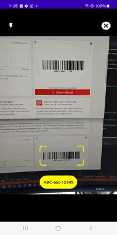 | 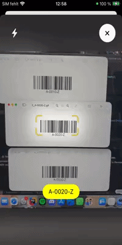 |
  
</details>

<details>
<summary><b>Multiple recognition</b></summary>

- `_barcodeScanner.ScanAsync(new BarcodeScanOptions({ RecognizeMultiple = true }))`
  - All detected barcodes are highlighted
  - Tap on the target barcode to display the confirmation button and complete the scan</br> </br>

| Android                                                  | iOS                                                             |
|----------------------------------------------------------|-----------------------------------------------------------------|
|  |  |
  
</details>

### 🟢 You don't want to highlight detected barcodes? 

<details>
<summary><b>Highlighting enabled(default)</b></summary>

- `_barcodeScanner.ScanAsync(new BarcodeScanOptions())`
  - All detected barcodes are highlighted</br> </br>

| Android                                           | iOS                                                      |
|---------------------------------------------------|----------------------------------------------------------|
| 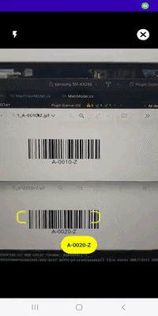 | 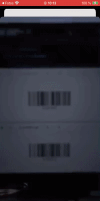 |

</details>

<details>
<summary><b>Highlighting disabled</b></summary>

- `_barcodeScanner.ScanAsync(new BarcodeScanOptions({ IsHighlightingEnabled = false }))`
  - No detected barcode is highlighted</br> </br>

| Android                                             | iOS                                                        |
|-----------------------------------------------------|------------------------------------------------------------|
| 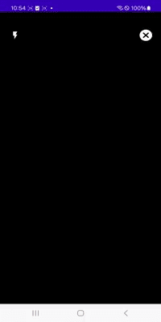 | 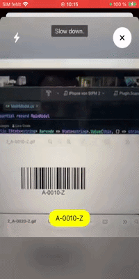 |

</details>

### 🟢 Allow a two-finger pinch-to-zoom gesture? 

<details>
<summary><b>Pinch to zoom enabled(default)</b></summary>

- `_barcodeScanner.ScanAsync(new BarcodeScanOptions())`

| Android                                          | iOS                                                     |
|--------------------------------------------------|---------------------------------------------------------|
|  |  |

</details>

<details>
<summary><b>Pinch to zoom disabled</b></summary>

- `_barcodeScanner.ScanAsync(new BarcodeScanOptions({ IsPinchToZoomEnabled = false }))`
  - No zoom allowed</br> </br>

</details>

### 🟢 Detect barcodes only in a specific area?
<details>
<summary><b>Specify region of interest</b></summary>

```csharp
BarcodeScanOptions options = new()
{
    RegionOfInterest = new CenteredRegionOfInterest(250, 200),
};
var barcode = (await _barcodeScanner.ScanAsync(options);
```
- Adds a vertical and horizontal-centered 250x200 detection area
- You can create your own area by implementing `IRegionOfInterest`
- A region of interest will also add a visual overlay</br> </br>

| Android                                               | iOS                                                          |
|-------------------------------------------------------|--------------------------------------------------------------|
|  |  |

</details>

### 🟢 You don't like the default overlay? Create your own!
Keep in mind that when using a Custom Overlay, you are responsible for the entire overlay (you cannot mix and match custom elements with the default overlay).

<details>
<summary><b>Custom overlay</b></summary>

Implement `Plugin.Scanner.Core.IOverlay` on each platform to create your own overlay.
See [overlay](src/Plugin.Scanner/Overlays) for an example implementation.

A cross-platform example can be found [here](tests/Plugin.Scanner.Maui.Tests/BarcodeCustomOverlay.cs).</br>
**This is just a showcase and not a production-ready implementation.**

Create a new instance and pass it to the options

```csharp
BarcodeScanOptions options = new()
{
    Overlay = myAwesomeOverlay,
};
```

</details>

## 🔎 Text scanning

Scan text blocks. Tap a text block to select it, then tap the button at the bottom of the screen to finish.

<details>
<summary><b>Implementation details</b></summary>

- On iOS the scanner uses VisionKits [DataScannerViewController](https://developer.apple.com/documentation/visionkit/datascannerviewcontroller?language=objc)
- On Android the scanner uses Googles [TextRecognition](https://developers.google.com/ml-kit/vision/text-recognition/v2/android)

</details>

<details>
<summary><b>MAUI & Uno</b></summary>

Resolve the registered ITextScanner service and scan a single text block in all supported supported languaged.

```csharp
public class MainViewModel
{
    private readonly ITextScanner _textScanner;;

    public MainViewModel(ITextScanner textScanner)
    {
        _textScanner = textScanner;
    }

    public async Task ScanText()
    {
        try
        {
            var text = await _textScanner.ScanAsync(new TextScanOptions()).ConfigureAwait(false);
        }
        catch(ScanException exception)
        {
            Debug.WriteLine(exception);
        }
    }
}
```

</details>

<details>
<summary><b>Avalonia</b></summary>

Since dependency injection is not available out of the box a static implementation of the scanner must be used.
If you use dependency injection register the ITextScanner serivce with the `IServiceCollection.AddScanner()` extension method. See Maui and Uno examples.

```csharp
public partial class MainViewModel
{
    public async Task ScanText()
    {
        try
        {
            var text = await TextScanner.Default.ScanAsync(new TextScanOptions()).ConfigureAwait(false);
        }
        catch (ScanException exception)
        {
            Debug.WriteLine(exception);
        }
    }
}
```

</details>

### 🟡 You don't want to highlight text blocks?

<details>
<summary><b>Highlighting enabled(default)</b></summary>

- `_textScanner.ScanAsync(new TextScanOptions())`
    - All detected barcodes are highlighted</br> </br>

| Android | iOS |
|----------|------|
|  |  |

</details>

<details>
<summary><b>Highlighting disabled</b></summary>

- `_textScanner.ScanAsync(new TextScanOptions({ IsHighlightingEnabled = false }))`
    - No detected text block is highlighted</br> </br>

| Android                                             | iOS                                                     |
|-----------------------------------------------------|---------------------------------------------------------|
|  | 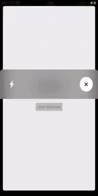 |

</details>

### 🟡 Allow a two-finger pinch-to-zoom gesture?

<details>
<summary><b>Pinch to zoom enabled(default)</b></summary>

- `_textScanner.ScanAsync(new TextScanOptions())`

| Android                                          | iOS                                                  |
|--------------------------------------------------|------------------------------------------------------|
|  |  |

</details>

<details>
<summary><b>Pinch to zoom disabled</b></summary>

- `_textScanner.ScanAsync(new TextScanOptions({ IsPinchToZoomEnabled = false }))`
    - No zoom allowed</br> </br>

</details>

### 🟡 Detect text only in a specific area?
<details>
<summary><b>Specify region of interest</b></summary>

```csharp
TextScanOptions options = new()
{
    RegionOfInterest = new CenteredRegionOfInterest(250, 200),
};
var barcode = await _textScanner.ScanAsync(options);
```
- Adds a vertical and horizontal-centered 250x200 detection area
- You can create your own area by implementing `IRegionOfInterest`
- A region of interest will also add a visual overlay</br> </br>

| Android                                               | iOS                                                       |
|-------------------------------------------------------|-----------------------------------------------------------|
|  |  |

</details>

### 🟡 You don't like the default overlay? Create your own!
Keep in mind that when using a Custom Overlay, you are responsible for the entire overlay (you cannot mix and match custom elements with the default overlay).

<details>
<summary><b>Custom overlay</b></summary>

Implement `Plugin.Scanner.Core.IOverlay` on each platform to create your own overlay.
See [overlay](src/Plugin.Scanner/Overlays) for an example implementation.

A cross-platform example can be found [here](tests/Plugin.Scanner.Maui.Tests/BarcodeCustomOverlay.cs).</br>
**This is just a showcase and not a production-ready implementation.**

Create a new instance and pass it to the options

```csharp
TextScanOptions options = new()
{
    Overlay = myAwesomeOverlay,
};
```

</details>